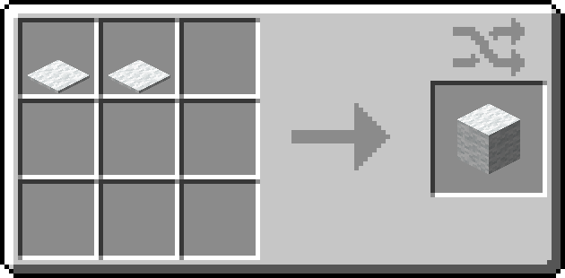

# Better Recycling

**Better Recycling** makes Minecraft more sustainable by introducing a variety of crafting and stonecutting recipes that let players recycle items and blocks. With this datapack, you can recover materials from previously crafted items and blocks, adding a fun and practical way to manage your resources.

## Slabs to Blocks
*Combine 2 slabs of any type to get back 1 full block.*

## Stairs to Blocks
*Convert stairs back into blocks, 2 stairs yield 1 full block.*

## Carpets to Wool
*Recycle carpets back into wool, 2 carpets yield 1 wool.*

## Item and Tool recycling
*Use the stonecutter to break down various tools, armor, and items to recover some materials. Recycling will usually loose a small portion of the original materials to keep things balanced.*

### Gold
* Gold Armor
* Gold Horse Armor
* Gold Tools
* Clock
* Light Weighted Pressure Plate
* Powered Rails
* Golden Carrot
* Golden Apple

### Iron
* Iron Armor
* Chainmail Armor
* Iron Horse Armor
* Iron Tools
* Compass
* Hopper
* Minecart
* Heavy Weighted Pressure Plate
* Bucket
* Shears
* Iron Door and Trapdoor

### Leather
* Leather Armor
* Leather Horse Armor
* Book
* Bundle
* Item Frame

## Why Use Better Recycling?

* Reduce waste and make use of those old tools and blocks sitting in chests.
* Add an immersive way to manage resources without breaking the game balance.
* Get more out of the items you already have.

Start recycling today and make your Minecraft world cleaner and greener! 🌱